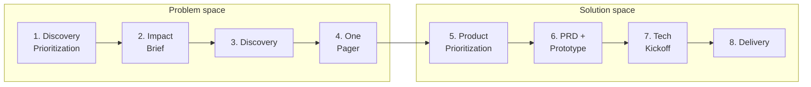
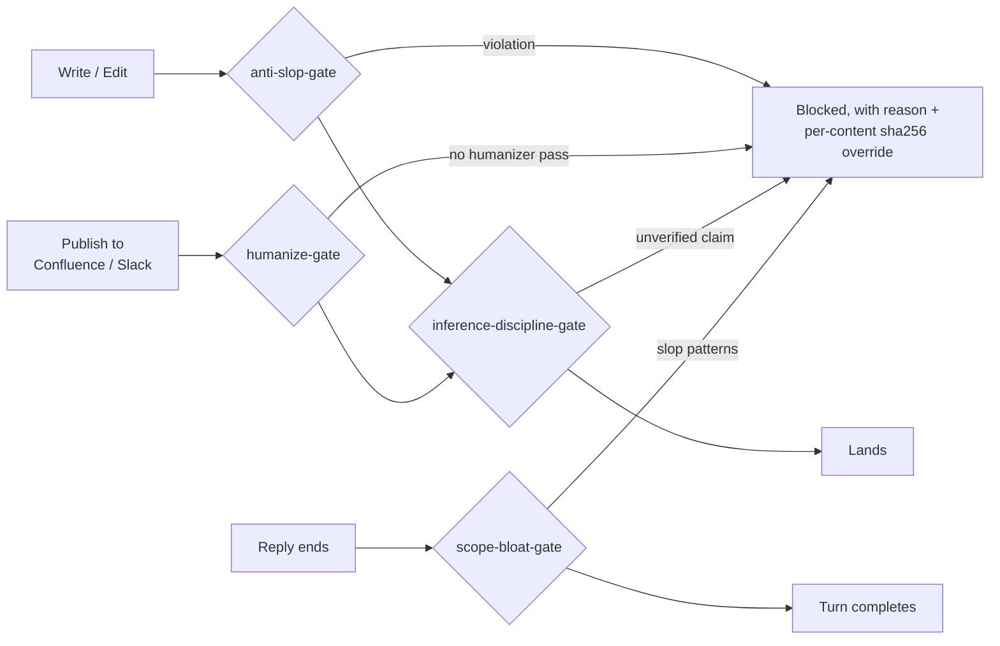

# ai-pm-toolkit

**A Claude Code operating system for product managers. Skills ask nicely; hooks enforce.**

[](LICENSE)
[](scripts/check_requirements.sh)
[](https://docs.anthropic.com/en/docs/claude-code)
[](.claude/skills/)
[](.claude/hooks/)
[](https://github.com/lukesw55/ai-pm-toolkit/pulls)

This toolkit turns a vague idea into a shipped increment through an 8-stage pipeline, 19 hard-skill PM skills, layered cross-project memory, and four runtime hooks that **block** AI slop, unverified claims, and unhumanized prose before they land anywhere. The skills are benchmarked against a no-skill baseline, so you can see what each one actually buys you.

It is the company-agnostic core of a working PM toolkit: the skills, agents, hooks, and doctrine one PM uses daily, with the employer-specific stack and customer evidence stripped out.

- [Why it exists](#why-it-exists)
- [At a glance](#at-a-glance)
- [The pipeline](#the-pipeline)
- [The skills](#the-skills)
- [Enforcement, not vibes](#enforcement-not-vibes)
- [The toolkit grades itself](#the-toolkit-grades-itself)
- [Memory that survives context switching](#memory-that-survives-context-switching)
- [The agents](#the-agents)
- [Install](#install)
- [Scripts](#scripts)
- [Validation](#validation)
- [Repository layout](#repository-layout)
- [Requirements](#requirements)
- [Troubleshooting](#troubleshooting)
- [License](#license)

## Why it exists

LLM coding agents default to plausible-but-bloated output: speculative abstractions, defensive checks at internal boundaries, confident claims about things they never verified, and prose that reads like a press release. For a PM driving an agent, that failure mode is expensive, because you are accountable for what ships and for what you tell stakeholders.

This toolkit encodes the corrections as reusable skills and as hooks the harness runs automatically. The model does not get to opt out.

## At a glance

| Capability | What it does | Where |
|---|---|---|
| 8-stage pipeline | Discovery Prioritization through Delivery, one gate per stage, current stage auto-injected into every turn | [`.claude/skills/WORKFLOW.md`](.claude/skills/WORKFLOW.md) |
| 19 hard-skill PM skills | 4 Double Diamond phases, 4 archetype lenses, 6 transversals, 4 quality gates, a repo doctor | [`.claude/skills/`](.claude/skills/) |
| 4 blocking runtime hooks | Reject slop prose, unverified claims, scope bloat, and unhumanized publishes at tool-call time | [`.claude/hooks/`](.claude/hooks/) |
| Skill benchmarking | Grades skill output against a no-skill baseline, emits an HTML report | [`scripts/grade_evals.py`](scripts/grade_evals.py) |
| Layered memory | Hot / warm / cold context that survives project switching; PII is never rotated | [`scripts/memory.py`](scripts/memory.py) |
| Orchestrator + 10 agents | "Umberto" detects the working mode and sequences stages; 6 core agents plus 4 PM archetypes | [`SKILL.md`](SKILL.md), [`.github/agents/`](.github/agents/) |
| Self-validation | Frontmatter, link, hook-wiring, and memory-contract checks in one command | [`scripts/validate_repo.py`](scripts/validate_repo.py) |

## The pipeline



Each stage has a skill that produces its artefact and a gate that must pass before advancing:

| # | Stage | Skill | Artefact | Gate |
|---|---|---|---|---|
| 1 | Discovery Prioritization | `pm-phase-define` + régua comum | `discovery-priorities.md` | top-N problems chosen, with rationale |
| 2 | Impact Brief | `pm-phase-discover` | `impact-brief-<topic>.md` | GTM impact + invalidation conditions named |
| 3 | Discovery | `pm-phase-discover` | discovery synthesis | problem framed, JTBD validated |
| 4 | One Pager | `pm-phase-define` | `one-pager-<topic>.md` | approved by stakeholders |
| 5 | Product Prioritization | `pm-phase-define` + régua comum | `priorities.md` update | bet approved for build |
| 6 | PRD + Prototype | `pm-phase-develop` | `prds/<feature>.md` + prototype | PRD approved, prototype validated |
| 7 | Tech Kickoff | `pm-phase-develop` | kickoff deck + epic | team aligned, dependencies and NFRs clear |
| 8 | Delivery | `pm-phase-deliver` | launch kit + close-out | GA shipped, impact measured |

The current stage lives in `.ai/memory/active-context.md` and is injected into every Claude Code turn by a `UserPromptSubmit` hook, so the model always knows where in the pipeline it is working. Stages advance with `python3 scripts/advance_stage.py <slug>`; the progression is a default, not a cage, and the bypass rules are documented in [`WORKFLOW.md`](.claude/skills/WORKFLOW.md).

The orchestrator is a skill codenamed **Umberto** ([`SKILL.md`](SKILL.md)). It detects the working mode first — Kickoff, Feature, Bug, or Rescue — then sequences the phases and loads the right skill at each stage.

## The skills

| Family | Skills | What they cover |
|---|---|---|
| Phases (4) | `pm-phase-discover`, `pm-phase-define`, `pm-phase-develop`, `pm-phase-deliver` | problem framing and research; strategy, KPI trees, prioritisation, business cases; PRDs, scope slicing, instrumentation; launch readiness, release comms, experiment interpretation |
| Archetype lenses (4) | `pm-archetype-ai`, `pm-archetype-enterprise`, `pm-archetype-growth`, `pm-archetype-platform` | evals and guardrails for probabilistic products; SSO/RBAC/compliance/procurement; funnels and experimentation discipline; APIs, DX, deprecation, SLOs |
| Transversals (6) | `pm-transversal-stakeholder`, `pm-transversal-docs`, `pm-transversal-analysis`, `pm-prioritization-regua-comum`, `pm-storytelling`, `data-science-analyst` | DACI and exec reporting; Confluence/Jira hygiene; quali+quant triangulation; Impact × Effort with one shared ruler; narrative spines; technical correctness of the analysis itself |
| Quality gates (4) | `anti-slop`, `humanizer`, `humanize-deliverables`, `inference-discipline` | slop removal for code and structure; prose that passes AI detectors; a publish gate for outbound artefacts; the hallucination gate |
| Tooling (1) | `repo-doctor` | read-only health check of this workspace |

The archetype lenses are full skills, and each also ships as an agent in [`.github/agents/`](.github/agents/) for harnesses that speak that dialect. They stack on top of any phase skill when the product context is non-default.

Every skill ships a `SKILL.md` as its control plane; 13 of 19 add a `references/` folder with ready-to-paste templates plus a `progressive-loading.md` map, so Claude loads the narrowest reference the task needs instead of a whole catalogue. 15 of 19 carry an `evals/` set so the skill can be graded rather than trusted.

Skills support three output profiles (see [`docs/patterns/COMMUNICATION_MODES.md`](docs/patterns/COMMUNICATION_MODES.md)): Standard for stakeholder-grade analysis, Lean for routine work (the default), Caveman for token-constrained sessions.

## Enforcement, not vibes

Four hooks in [`.claude/hooks/`](.claude/hooks/), wired through [`.claude/settings.json`](.claude/settings.json), reject bad output at tool-call time:

| Hook | Fires on | Blocks |
|---|---|---|
| `anti-slop-gate.sh` | every file write/edit | forbidden file artefacts (unrequested PLAN/SUMMARY/NOTES files), banner comments, decorative emoji headings |
| `inference-discipline-gate.sh` | writes and outbound publishes | content that smuggles an inference in as fact: every claim about external state must be verified or explicitly tagged and approved |
| `humanize-gate.sh` | Confluence / Slack / Jira publish tools | AI-tinted prose shipping outbound before a `humanizer` pass, tracked by a per-content sha256 sentinel |
| `scope-bloat-gate.sh` | end of every reply (Stop) | em-dash density, label-colon bullet runs, headers on short questions, scope bloat |



Each gate has an explicit, per-content override for legitimate exceptions, so the enforcement is strict without being a dead end. Two softer hooks complete the wiring: `memory-context.sh` injects the memory hot layer at session start, and `check-project-isolation.sh` warns when a tool touches another project's memory.

## The toolkit grades itself

15 of the 19 skills ship an `evals/evals.json` with realistic task prompts. [`scripts/grade_evals.py`](scripts/grade_evals.py) grades recorded runs **with the skill against a no-skill baseline** — assertion by assertion — and renders a static HTML benchmark report with pass rates, timing, and token cost per configuration.

The point is falsifiability: a skill that does not beat the baseline on its own evals is a skill to fix or delete, not to keep out of sentiment.

## Memory that survives context switching

| Layer | Contents | When it is read |
|---|---|---|
| Hot | a capped pointer (`active-context.md`) plus the active project | injected at session start |
| Warm | the project's state, kickoff, decisions, recent changelog | only when working on that project |
| Cold | archives, raw evidence, transcripts | never wholesale; retrieved on demand |

Writing memory goes through [`scripts/memory.py`](scripts/memory.py) (`log`, `park`, `activate`, `distill`, `doctor`), which rotates old changelog entries into archives and keeps the pointer under its 2 KB cap. PII and raw-evidence paths are never rotated, distilled, or ingested. The shipped tree contains only templates, so a fresh clone bootstraps its own memory with one command.

## The agents

[`.github/agents/`](.github/agents/) holds ten agents. Six are core: **Lang** (kickstart and reframing), **Umberto** (the main builder), **Torvalds** (architecture and tradeoffs), **Margaret** (TDD and metric quality), **Rand** (design), **Mnemosyne** (memory steward). Four mirror the archetype skills — `pm-platform`, `pm-growth`, `pm-enterprise`, `pm-ai` — for non-default product contexts. Default orchestration chains live in [`AGENTS.md`](AGENTS.md).

## Install

Clone it as a project repo and open it in Claude Code. The hooks in `.claude/settings.json` fire at the project level, so opening the folder as a project is what turns enforcement on:

```bash
git clone https://github.com/lukesw55/ai-pm-toolkit.git
cd ai-pm-toolkit
bash scripts/check_requirements.sh   # preflight: python3, jq, sha256
python3 scripts/validate_repo.py     # structural self-check

# bootstrap your first project context
python3 scripts/init_context.py "my-product"
python3 scripts/memory.py doctor
```

Then, in Claude Code, invoke any skill by name (for example `pm-phase-discover`) or talk to the orchestrator:

```text
We are starting my-product. Read the context files.
Run Discover and Define. Ask only the highest-leverage missing questions.
Create an experiment plan for the smallest viable proof. Update memory when done.
```

## Scripts

| Script | Purpose |
|---|---|
| `init_context.py` | bootstrap a project: memory files, warm layer, and the active pointer (refuses to clobber an active project) |
| `memory.py` | memory policy engine: `log`, `park`, `activate`, `distill`, `doctor` |
| `stage_context.py` | inject the current workflow stage into every turn (`UserPromptSubmit` hook) |
| `advance_stage.py` | move the pipeline to the next stage |
| `context_watch.py` | live CLI view of the active context and time spent per context |
| `log_decision.py` | append a decision to the active project's decision log |
| `validate_context.py` | schema check for `active-context.md` |
| `grade_evals.py` | grade eval runs with-skill vs baseline; emit benchmark JSON + HTML report |
| `validate_repo.py` | structural validator: frontmatter, links, workflow contract, hook wiring, memory bootstrap |
| `check_requirements.sh` | environment preflight (python3, jq, bash, sha256) |

## Validation

Run the repo doctor before shipping changes to the toolkit itself:

```bash
bash scripts/check_requirements.sh
python3 -m py_compile scripts/*.py
bash -n .claude/hooks/*.sh
python3 scripts/validate_repo.py
python3 scripts/memory.py doctor
```

`validate_repo.py` checks skill frontmatter, local markdown links, workflow-stage parsing, Claude hook settings, hook syntax, and the memory bootstrap contract. It is zero-dependency except for optional PyYAML; without PyYAML it falls back to minimal frontmatter checks. The full checklist lives in [`docs/REPO_HEALTH.md`](docs/REPO_HEALTH.md).

## Repository layout

```text
.
├── SKILL.md                 # orchestration entrypoint (Umberto)
├── CLAUDE.md                # working doctrine and guardrails
├── AGENTS.md                # agent registry
├── .claude/
│   ├── settings.json        # hook wiring
│   ├── hooks/               # 4 blocking gates, 3 mark helpers, 2 context hooks
│   └── skills/
│       ├── WORKFLOW.md      # 8-stage pipeline mapped to skills and gates
│       ├── pm-phase-*/      # the four phases
│       ├── pm-archetype-*/  # ai / enterprise / growth / platform lenses
│       ├── pm-transversal-*/, pm-prioritization-*/, pm-storytelling/
│       ├── anti-slop/, humanizer/, humanize-deliverables/, inference-discipline/
│       ├── data-science-analyst/
│       └── repo-doctor/     # most skills: references/ + evals/ + progressive-loading.md
├── docs/                    # process, memory model, guardrails, comms modes, repo health
├── scripts/                 # memory, workflow, eval, and validation tooling
├── .ai/                     # project-brief templates + memory skeleton
└── .github/agents/          # 6 core agents + 4 PM archetypes
```

## Requirements

- Claude Code with project-level `.claude/settings.json` enabled.
- Python 3.10+ for memory, workflow, eval, and repo validation scripts.
- Bash for hooks.
- `jq` for hook JSON parsing.
- Either `sha256sum` (Linux) or `shasum -a 256` (macOS) for per-content sentinels.

## Troubleshooting

- **`memory.py doctor` says there is no ACTIVE block:** run `python3 scripts/init_context.py "Project Name"` or activate a project with `python3 scripts/memory.py activate <slug>`.
- **`init_context.py` refuses to run:** another project is still active; park it first with `python3 scripts/memory.py park <slug>`.
- **Hooks fail with `jq: command not found`:** install `jq`, then rerun `bash scripts/check_requirements.sh`.
- **macOS hash command fails:** hooks fall back from `sha256sum` to `shasum -a 256`; if both are missing, install the standard command-line tools.
- **A publish tool is blocked by `humanize-gate`:** run the `humanizer` pass, then mark the exact final bytes with `.claude/hooks/humanize-mark.sh`.
- **A file edit is blocked by inference discipline:** resolve the unresolved inference markers (INFER, ASSUMING, UNVERIFIED, FROM MEMORY, RECALL), or explicitly approve and mark the exact exception.
- **Workflow stage output is too thin:** check `.ai/memory/active-context.md` has `Current stage` set to one of the canonical slugs in `.claude/skills/WORKFLOW.md`.

## License

MIT. See [LICENSE](LICENSE). Issues and PRs welcome.
