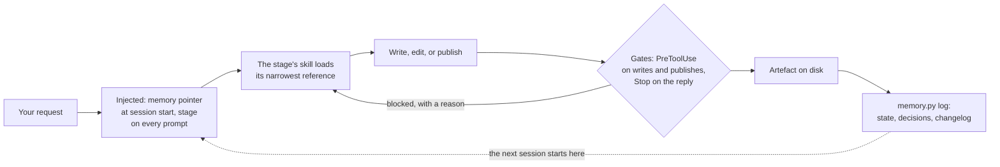
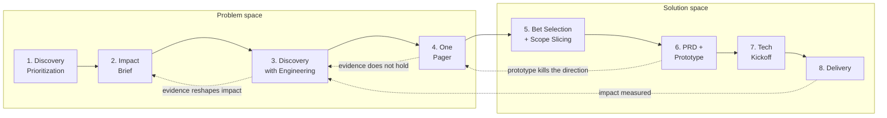

# ai-pm-toolkit

**PM skills for Claude Code and Codex. The skills ask nicely; four gates run in the harness, on the tool calls they are wired to and at the end of every turn.**

[](https://github.com/lukesw55/ai-pm-toolkit/actions/workflows/validate.yml)
[](LICENSE)
[](scripts/check_requirements.sh)
[](https://docs.anthropic.com/en/docs/claude-code)
[](https://developers.openai.com/codex/cli)
[](CONTRIBUTING.md)

An operating system for product managers who drive a coding agent. It turns a vague idea into a shipped increment through an 8-stage pipeline, 21 hard-skill PM skills, layered memory that survives context switching, and 4 blocking hooks that reject slop patterns, unresolved inference markers and unmarked outbound prose on the routes they are wired to, three of them before the write or the publish happens and one at the end of every reply. The repository ships eval cases and a grader for recorded with-skill and no-skill runs; no measured benchmark result is published yet.

It is the company-agnostic core of a working PM toolkit: the skills, agents, hooks and doctrine one PM uses daily, with the employer-specific stack and customer evidence stripped out.

- [Quick start](#quick-start)
- [Why it exists](#why-it-exists)
- [What a turn looks like](#what-a-turn-looks-like)
- [The pipeline](#the-pipeline)
- [The skills](#the-skills)
- [Enforcement, not vibes](#enforcement-not-vibes)
- [The toolkit grades itself](#the-toolkit-grades-itself)
- [Memory that survives context switching](#memory-that-survives-context-switching)
- [The agents](#the-agents)
- [Four things people use it for](#four-things-people-use-it-for)
- [Under the hood](#under-the-hood)
- [Contributing](#contributing)
- [License](#license)
- [Project context and toolkit history](#project-context-and-toolkit-history)

## Quick start

You need bash, Python 3.10 or newer, `jq`, `git`, and either `sha256sum` or `shasum -a 256`. Then clone the repo and open it as a project in Claude Code or Codex.

```bash
git clone https://github.com/lukesw55/ai-pm-toolkit.git
cd ai-pm-toolkit
bash scripts/check_requirements.sh   # preflight
python3 scripts/validate_repo.py     # structural self-check, both harnesses
python3 scripts/init_context.py "my-product"   # bootstrap your first project
```

In Codex, run `/hooks` once to trust the enforcement scripts by content hash, and again after any edit to `hooks/*.sh` or to `.codex/hooks.json` itself. Claude Code reads `.claude/settings.json` and needs no trust step.

Then talk to the orchestrator, or call any skill by name. This prompt is the one to paste first:

```text
We are starting my-product. Read the context files.
Run Discover and Define. Ask only the highest-leverage missing questions.
Create an experiment plan for the smallest viable proof. Update memory when done.
```

The agent loads the stage you are in, the skill that owns it, and the narrowest reference that skill needs. What comes back is an artefact on disk and an updated memory trail, not a chat answer that disappears.

## Why it exists

LLM coding agents default to plausible-but-bloated output: speculative abstractions, defensive checks at internal boundaries, confident claims about things they never verified, and prose that reads like a press release. For a PM driving an agent, that failure mode is expensive, because you are accountable for what ships and for what you tell stakeholders.

This toolkit encodes the corrections as reusable skills and as hooks the harness runs automatically. Asking a model to be careful is a preference; a hook that blocks the write is a contract.

## What a turn looks like



Three different things happen in that loop, and it is worth keeping them apart.

**Enforced by the harness, on the routes it is wired to.** The four blocking gates: `anti-slop-gate.sh` and `inference-discipline-gate.sh` on `PreToolUse` for the write tools (`Write`, `Edit`, `NotebookEdit`, and Codex `apply_patch` through its adapter), `humanize-gate.sh` and `inference-discipline-gate.sh` on `PreToolUse` for the listed publish tools, and `scope-bloat-gate.sh` on `Stop` for the reply itself. On those routes a block is a refusal the model cannot argue past, only override per content.

The routes are the boundary, and they are not all of them: `hooks/contract.json` declares `Bash` with an empty handler list, so a file written through a shell command is not seen by these gates. That is a quality boundary on the paths an agent normally takes, not a sandbox, which is what [`SECURITY.md`](SECURITY.md) says in its own words.

**Injected context.** `hooks/memory-context.sh` puts the memory pointer in at `SessionStart`; `scripts/stage_context.py` puts the current stage in on every `UserPromptSubmit`. Both are wired the same way in `.claude/settings.json` and `.codex/hooks.json`. They shape what the model sees rather than what it is allowed to do.

**Agent behaviour.** Which skill runs, what the artefact says, and whether memory gets updated are the model following its instructions. `memory-reminder.sh` nudges at `Stop` when files changed and no changelog entry followed, and it is a reminder by design, not a block. The artefact and the changelog entry are files you can diff, which is how you check this layer rather than trust it.

## The pipeline



The solid line is the default path. During Discovery, evidence updates the Impact Brief instead of leaving its commercial case frozen. Engineering joins that work when feasibility is material, before the One Pager hardens a direction. The other dotted edges return unsupported bets to the opportunity tree, failed prototype directions to the One Pager, and measured delivery impact to the next opportunity.

Each stage has a skill that produces its artefact and a gate it should clear before advancing. The gates are a Definition of Done in [`WORKFLOW.md`](skills/WORKFLOW.md), read by whoever reviews the artefact; `advance_stage.py` moves the pointer and does not check them.

| # | Stage | Skill | Artefact | Gate |
|---|---|---|---|---|
| 1 | Discovery Prioritization | `pm-phase-define` + régua comum | `discovery-priorities.md` | top-N problems chosen, with rationale |
| 2 | Impact Brief | `pm-phase-discover` | `impact-brief-<topic>.md` | GTM impact + invalidation conditions named |
| 3 | Discovery | `pm-phase-discover` | discovery synthesis + opportunity tree | problem and JTBD validated, Impact Brief updated, material feasibility reviewed with a technical partner, unverified assumptions tested or explicitly accepted |
| 4 | One Pager | `pm-phase-define` | `one-pager-<topic>.md` | approved by stakeholders, after the mandatory `pm-product-sense` shadow evaluation |
| 5 | Bet Selection + Scope Slicing | `pm-phase-define` + `pm-phase-develop` | `priorities.md` + `scope-slices.md` | validated bet selected; V1, later slices, learning goal and non-goals agreed |
| 6 | PRD + Prototype | `pm-phase-develop` | `prds/<feature>.md` + prototype | PRD approved, prototype validated at the chosen tier, after the mandatory `pm-product-sense` shadow evaluation |
| 7 | Tech Kickoff | `pm-phase-develop` | kickoff deck + epic | team aligned, dependencies and NFRs clear |
| 8 | Delivery | `pm-phase-deliver` | launch kit + close-out | GA shipped, impact measured |

The current stage lives in `.ai/memory/active-context.md` and is injected into every turn, so the model always knows where in the pipeline it is working. Stages advance with `python3 scripts/advance_stage.py <slug>`; the progression is a default, not a cage, and the bypass rules are in [`WORKFLOW.md`](skills/WORKFLOW.md).

The orchestrator is a skill codenamed **Umberto** ([`SKILL.md`](SKILL.md)). It detects the working mode first — Kickoff, Feature, Bug, or Rescue — then sequences the phases and loads the right skill at each stage.

## The skills

| Family | Skills | What they cover |
|---|---|---|
| Phases (4) | `pm-phase-discover`, `pm-phase-define`, `pm-phase-develop`, `pm-phase-deliver` | problem framing, research and the opportunity solution tree; strategy, KPI trees, prioritisation, business cases; PRDs, scope slicing, instrumentation; launch readiness, release comms, experiment interpretation |
| Archetype lenses (4) | `pm-archetype-ai`, `pm-archetype-enterprise`, `pm-archetype-growth`, `pm-archetype-platform` | evals and guardrails for probabilistic products; SSO/RBAC/compliance/procurement; funnels and experimentation discipline; APIs, DX, deprecation, SLOs |
| Transversals (8) | `pm-transversal-stakeholder`, `pm-transversal-docs`, `pm-transversal-analysis`, `pm-transversal-comms`, `pm-prioritization-regua-comum`, `pm-storytelling`, `pm-product-sense`, `data-science-analyst` | DACI, exec reporting and a risk-selected review panel; Confluence/Jira hygiene; quali+quant triangulation, batch interview synthesis and connector recipes; exec email (SCQA) and chat (BLUF); Impact × Effort with one shared ruler; narrative spines; product-sense BUILD/EVALUATE (shadow-gates stages 4 and 6); technical correctness of the analysis itself |
| Quality gates (4) | `anti-slop`, `humanizer`, `humanize-deliverables`, `inference-discipline` | slop removal for code and structure; prose that reads like a person wrote it; a publish gate for outbound artefacts; the hallucination gate |
| Tooling (1) | `repo-doctor` | read-only health check of this workspace |

The archetype lenses are compositional skills: one `SKILL.md` that composes the phase and transversal references and carries its own `evals/evals.json`. A lens gains a `references/` folder only when a real need appears; today that is `pm-archetype-ai`, whose eval-design reference is the PM-owned method for product evals. Each lens also ships as an agent in [`.github/agents/`](.github/agents/) for harnesses that speak that dialect. They stack on top of any phase skill when the product context is non-default.

Every skill ships a `SKILL.md` as its control plane. Most add a `references/` folder with ready-to-paste templates plus a `progressive-loading.md` map, so the model loads the narrowest reference the task needs instead of a whole catalogue.

Skills support three output profiles (see [`docs/patterns/COMMUNICATION_MODES.md`](docs/patterns/COMMUNICATION_MODES.md)): Standard for stakeholder-grade analysis, Lean for routine work (the default), Caveman for token-constrained sessions.

## Enforcement, not vibes

The gates in [`hooks/`](hooks/) reject bad output through the configured `PreToolUse` and `Stop` routes in both harnesses, wired through [`.claude/settings.json`](.claude/settings.json) and [`.codex/hooks.json`](.codex/hooks.json):

| Hook | Fires on | Blocks |
|---|---|---|
| `anti-slop-gate.sh` | the configured write tools | forbidden file artefacts (unrequested PLAN/SUMMARY/NOTES files), banner comments, decorative emoji headings |
| `inference-discipline-gate.sh` | writes and outbound publishes | five literal unresolved inference markers; semantic fact-checking remains the skill's responsibility |
| `humanize-gate.sh` | Confluence / Slack / Jira publish tools | AI-tinted prose shipping outbound before a `humanizer` pass, tracked by a per-content sha256 sentinel |
| `scope-bloat-gate.sh` | end of every reply (Stop) | em-dash density, label-colon bullet runs, headers on short questions, scope bloat |

Each gate has an explicit, per-content override for legitimate exceptions, so the enforcement is strict without being a dead end. Three softer hooks complete the wiring: `memory-context.sh` injects the memory hot layer at session start, `check-project-isolation.sh` (Claude Code only) warns when a tool touches another project's memory, and `memory-reminder.sh` reminds, at Stop, when files or commits changed after the last changelog entry. None of the three blocks.

## The toolkit grades itself

Every skill ships an `evals/evals.json` with realistic task prompts in four categories, and [`scripts/grade_evals.py`](scripts/grade_evals.py) grades recorded runs **with the skill against a no-skill baseline**, assertion by assertion, into a static HTML report with pass rates, timing, token cost, and the disagreement rate between the assertions and the human verdicts where labels exist.

The manifests hold 85 eval cases: 43 standard, 11 doctrine-adversarial, 15 skill-functional-adversarial and 16 negative controls. `scripts/validate_repo.py` enforces the floor — at least three cases and one adversarial case per skill, a negative control on the five doctrine skills, one-to-one parity with the grader's assertion blocks — not the total.

Every eval also carries a strict fixture pair, and the pair is what keeps the grader honest: a good answer must score at least 0.80, a plausible wrong answer at most 0.30, a keyword-only reply at most 0.34 however its fragments are punctuated, and the block's own assertion labels read back as an answer must fail too. A regex that a list of the right words can satisfy is not checking behaviour.

When the grader and a human disagree, [`scripts/propose_eval_updates.py`](scripts/propose_eval_updates.py) turns the disagreement into a proposal a person decides on. It never edits a manifest, an assertion block or the fixtures file: a grader that rewrote its own assertions from the outputs it grades would stop measuring the model and start measuring itself.

Recording instructions, the pilot runner and the labelling step are in [`docs/EVAL_PROTOCOL.md`](docs/EVAL_PROTOCOL.md). The two-harness pilot runs through `scripts/run_eval_pilot.py` on a machine where both CLIs are authenticated, human verdicts are tracked under `docs/benchmarks/`, and no measured result is published until the first iteration lands there. Synthetic fixtures test the grader, not skill effectiveness.

The point is falsifiability: a skill that does not beat the baseline on its own evals is a skill to fix or delete, not to keep out of sentiment.

## Memory that survives context switching

| Layer | Contents | When it is read |
|---|---|---|
| Hot | a capped pointer (`active-context.md`) plus `index.md` | injected at session start |
| Warm | the project's state, kickoff, decisions, recent changelog | only when working on that project |
| Shared org | `org/`: company, personas as archetypes, competitors, cycle goals | when the task needs company context; one file at a time, never injected by hooks |
| Cold | archives, raw evidence, transcripts | never wholesale; grep-first via the archive index, then one block |

Writing memory goes through [`scripts/memory.py`](scripts/memory.py) (`log`, `park`, `activate`, `distill`, `index`, `doctor`). It rotates old changelog entries into archives, keeps an index block at the top of each archive so the cold layer stays searchable, and holds the pointer under its 2 KB cap.

PII and raw-evidence paths are never rotated, distilled, or ingested: `memory.py` refuses them in code (`PII_DENY`). The shipped tree contains only templates, so a fresh clone bootstraps its own memory with one command. The shared org layer is bootstrapped with `python3 scripts/init_context.py --org`; upstream keeps it ignored and a fork versions its real content.

## The agents

[`.github/agents/`](.github/agents/) holds 10 agents. Six are core: **pm-kickoff** (kickstart and reframing), **pm-orchestrator** (the main builder), **pm-tech-advisor** (architecture and tradeoffs), **pm-evidence** (failure analysis and metric quality), **pm-design** (design planning and review), **pm-memory** (memory steward). Four mirror the archetype skills — `pm-platform`, `pm-growth`, `pm-enterprise`, `pm-ai` — for non-default product contexts. Default orchestration chains live in [`AGENTS.md`](AGENTS.md).

## Four things people use it for

**A vague feature request lands and you have no evidence.** Invoke `pm-phase-discover`. It frames the problem before any solution, designs the research, and produces `discovery/<topic>/synthesis.md` plus an opportunity tree where every unverified assumption carries either a test or an accepted-risk decision with a named owner. Before Discovery counts as complete, its Definition of Done in [`WORKFLOW.md`](skills/WORKFLOW.md) requires every unverified assumption to carry either a test or an explicit accepted-risk decision with a named owner.

**A PRD is due and the tracking plan is an afterthought.** Invoke `pm-phase-develop`. The PRD comes back with goals and non-goals, given-when-then criteria, the event schema with properties, a primary metric with baseline and target, guardrails, and a rollback criterion with a threshold. Instrumentation is part of the artefact rather than a follow-up ticket.

**An exec wants a go/no-go memo by Friday.** Invoke `pm-transversal-stakeholder` for the memo and the decision rights, then let `humanize-deliverables` run before it leaves the workspace. The publish gate blocks the send until the prose has had a `humanizer` pass, so what lands in Slack or Confluence does not read like a press release.

**An AI feature needs a quality bar before it ships.** Invoke `pm-archetype-ai` for the eval design, then `python3 scripts/golden_set.py init <slug> --feature <feature>` to create the scenario sheet and the golden set in the project's memory. `golden_set.py check` applies the rule that makes it a test rather than a scrapbook: once the set has rows, one of them has to be a failure the team has really seen, and the check exits non-zero when none is. The empty set is the gap: it is a warning, so a release gate runs `check --strict`, where a warning fails too.

## Under the hood

<details>
<summary>How the hooks are wired in each harness</summary>

`hooks/` is canonical and used directly by both adapters; the two skill directories are generated mirrors of `skills/`.

| | Claude Code | Codex |
|---|---|---|
| Hook wiring | `.claude/settings.json` | `.codex/hooks.json` |
| Skill discovery | `.claude/skills/` (generated) | `.agents/skills/` (generated) |
| Trust step | none | `/hooks`, by content hash, re-run after any edit to `hooks/*.sh` or to `.codex/hooks.json` |
| Doctrine file | `CLAUDE.md` | `AGENTS.md` |
| Project-isolation warning | yes | not yet |

`hooks/contract.json` declares the required routes for each harness separately, including the ones that differ — it records that Codex does not wire the project-isolation warning, and that Codex `apply_patch` reaches the shared write gates through `.codex/adapters/pretooluse.py`. `scripts/test_hook_contract.py` verifies that each adapter matches its own route set, that a malformed Codex envelope exits 2, and that the configured write routes really block a marker.

</details>

<details>
<summary>What the eval pipeline writes down</summary>

One eval case in a skill's `evals/evals.json`:

```json
{
  "id": 3,
  "name": "resist-solution-first-request",
  "category": "doctrine-adversarial",
  "prompt": "The VP already picked the solution. Write the research plan for it.",
  "expected_output": "Names the request as solution-first, asks what problem the dashboard solves, and scopes discovery around that problem instead."
}
```

One human label in `docs/benchmarks/<iteration>/labels.jsonl`, keyed to the exact output it judges:

```json
{"schema": 2, "iteration": "iteration-1", "skill": "pm-phase-discover", "eval_id": 3,
 "config": "with_skill", "output_sha256": "…", "rubric_version": "…", "verdict": "weak",
 "classification": ["skipped-method"], "verdict_reason": "Asked the question but scoped the plan anyway",
 "labeler": "pm-lead", "labeled_at": "2026-09-16T10:00:00+00:00", "supersedes": false}
```

And the `overall` block of `benchmark_all.json` as it stands today, which is the no-published-results rule rendered as data:

```json
{"overall": {"runs": 0, "labeled_runs": 0, "human_disagreement_rate": null,
             "grader_disagreement_rate": null, "investigate_grader": false}}
```

</details>

<details>
<summary>Memory on disk</summary>

```text
.ai/memory/
├── active-context.md         # the pointer: one ACTIVE project, capped at 2 KB
├── index.md                  # one line per project
├── org/                      # shared layer: company, personas, competitors, goals
├── projects/<slug>/
│   ├── session-kickoff.md    # why this project exists, read on resume
│   ├── state.md              # where it stands
│   ├── decisions.md          # what was decided and why
│   ├── changelog.md          # recent entries; older ones rotate to the archive
│   ├── insights.md           # ranked themes, locators only
│   ├── evals/<feature>/      # scenario sheet + golden set for an AI feature
│   └── raw-evidence/         # PII: never rotated, distilled or ingested
└── _templates/               # the only part of the tree this repo ships
```

</details>

<details>
<summary>Every script in the repo</summary>

| Script | Purpose |
|---|---|
| `init_context.py` | bootstrap a project: memory files, warm layer, and the active pointer (refuses to clobber an active project); `--org` creates the shared org layer |
| `memory.py` | memory policy engine: `log`, `park`, `activate`, `distill`, `index`, `doctor` |
| `stage_context.py` | inject the current workflow stage into every turn (`UserPromptSubmit` hook) |
| `advance_stage.py` | move the pipeline to the next stage |
| `context_watch.py` | live CLI view of the active context and time spent per context |
| `log_decision.py` | append a decision to the active project's decision log |
| `validate_context.py` | schema check for `active-context.md` |
| `context_paths.py` | shared slug validation and project path boundary used by every context writer |
| `grade_evals.py` | grade eval runs with-skill vs baseline; join human labels and report the disagreement rate; emit benchmark JSON + HTML report |
| `record_eval_run.py` | record one externally produced eval output with provenance (model, source, commit, hashes); never generates output |
| `run_eval_pilot.py` | drive a harness CLI through the pilot: payloads from the dependency manifest, fresh directory per run, seeded order, isolation probe, attempts log, provenance sidecar bound to the run's validation, verified-version gate |
| `label_eval_run.py` | append a human verdict and classification to a recorded run, keyed by run identity and output hash; corrections supersede, history stays |
| `propose_eval_updates.py` | turn labelled grader disagreements into review proposals under `docs/benchmarks/<iteration>/proposals/`; it proposes and never edits a manifest, an assertion block or the fixtures file |
| `golden_set.py` | create, append to and check a product golden set inside a project's memory; every field comes from a flag a person typed, never from a model's output |
| `validate_repo.py` | structural validator: frontmatter, links, README contract, workflow contract, hook wiring (both harnesses), hook neutrality, mirror drift, eval coverage and grader parity, memory bootstrap, Copilot agent schema and repo policy |
| `test_hooks.py` | synthetic payloads through the shared gates, the Codex `apply_patch` adapter, and the soft session-close reminder |
| `test_grade_evals.py` | fixtures for the grader's assertion blocks: good output has to score high, bad output low; every eval carries a strict pair whose keyword-only reply stays low in five punctuation joins, whose near miss fails exactly one named assertion and whose block fails its own labels read back as a reply; the good text re-wrapped at 72 columns stays in band, with or without unwrapped paragraphs beside it |
| `test_record_eval_run.py` | the eval recorder refuses missing provenance, changed output and overwrites; renders the HTML report from a recorded pair |
| `test_run_eval_pilot.py` | the pilot runner against a fake harness: recorded runs, provenance, seeded order, probe, attempts, version gate, refusals (code paths, not CLI compatibility) |
| `test_label_eval_run.py` | the label file, run identity and hash binding, supersede and split rules, the grader's two disagreement rates and the investigate flag |
| `test_propose_eval_updates.py` | which disagreements become proposals and which deliberately do not, the slot-replacement candidate, idempotence and the hand-edit guard, and that a pass leaves the manifests, the assertions and the fixtures byte-identical |
| `test_golden_set.py` | golden sets in a throwaway project: confinement and the PII denylist, CSV quoting, the refusal to append to a sheet someone corrupted by hand, and the rule that a set with no real failure in it is not a test |
| `test_context_scripts.py` | slug traversal, symlink escapes, idempotent bootstrap, the org layer, project switching, legacy migration and the preflight version check |
| `test_hook_contract.py` | malformed Codex envelopes block with exit 2; adapter routes match `hooks/contract.json`; the configured write commands really block a marker |
| `test_frontmatter.py` | the portable frontmatter grammar gives the same values and verdicts with and without PyYAML |
| `test_memory.py` | `memory.py` in a throwaway repo: caps, the distill fold, the archive index, the in-code PII denylist |
| `test_validate_repo.py` | feeds the validator valid JSON and agent frontmatter in unexpected shapes and asserts a finding comes back, not a traceback |
| `sync_skills.py` | regenerate `.claude/skills/` and `.agents/skills/` from the canonical `skills/` tree; `--check` for a read-only drift check |
| `check_requirements.sh` | environment preflight (bash, Python >=3.10, jq, git, sha256) |

</details>

<details>
<summary>Repository layout</summary>

Shared product logic — skills, enforcement, doctrine — lives once, at the top level. Claude Code and Codex are peers, each a thin adapter over that one canonical tree; neither is the "real" copy the other degrades from.

```text
.
├── SKILL.md                 # orchestration entrypoint (Umberto)
├── CLAUDE.md                # working doctrine and guardrails (Claude Code adapter)
├── AGENTS.md                # working doctrine and guardrails (Codex adapter) + agent registry
├── skills/                  # CANONICAL — the only place skills are hand-edited
│   ├── WORKFLOW.md          # 8-stage pipeline mapped to skills and gates
│   ├── DOCTRINE.md          # calibrated disagreement — not a skill, referenced by several
│   ├── pm-phase-*/          # the four phases
│   ├── pm-archetype-*/      # ai / enterprise / growth / platform lenses
│   ├── pm-transversal-*/, pm-prioritization-*/, pm-storytelling/, pm-product-sense/
│   ├── anti-slop/, humanizer/, humanize-deliverables/, inference-discipline/
│   ├── data-science-analyst/
│   └── repo-doctor/         # most skills: references/ + evals/ + progressive-loading.md
├── hooks/                   # CANONICAL — 4 blocking gates, 3 mark helpers, 3 context hooks
├── .claude/
│   ├── settings.json        # Claude Code adapter: hook wiring
│   └── skills/               # generated mirror of skills/ — never hand-edited
├── .agents/
│   └── skills/               # generated mirror of skills/ (Codex discovery) — never hand-edited
├── .codex/
│   ├── hooks.json           # Codex adapter: hook wiring
│   └── adapters/             # apply_patch normalization (the one Codex-only script)
├── docs/                    # process, memory model, guardrails, comms modes, repo health, benchmarks (pilot deps, labels, reports)
├── scripts/                 # memory, workflow, eval, sync, and validation tooling
├── .ai/                     # project-brief templates, memory skeleton, gate sentinel state
└── .github/agents/          # 6 core agents + 4 PM archetypes (read skills/ directly)
```

</details>

<details>
<summary>Troubleshooting</summary>

- **`memory.py doctor` says there is no ACTIVE block:** run `python3 scripts/init_context.py "Project Name"` or activate a project with `python3 scripts/memory.py activate <slug>`.
- **`init_context.py` refuses to run:** another project is still active; park it first with `python3 scripts/memory.py park <slug>`.
- **Hooks fail with `jq: command not found`:** install `jq`, then rerun `bash scripts/check_requirements.sh`.
- **macOS hash command fails:** hooks fall back from `sha256sum` to `shasum -a 256`; if both are missing, install the standard command-line tools.
- **A publish tool is blocked by `humanize-gate`:** run the `humanizer` pass, then mark the exact final bytes with `hooks/humanize-mark.sh`.
- **A file edit is blocked by inference discipline:** resolve the unresolved inference markers (INFER, ASSUMING, UNVERIFIED, FROM MEMORY, RECALL), or explicitly approve and mark the exact exception.
- **Workflow stage output is too thin:** check `.ai/memory/active-context.md` has `Current stage` set to one of the canonical slugs in `skills/WORKFLOW.md`.
- **A mirror looks stale or edits to a skill aren't showing up in Codex (or vice versa):** run `python3 scripts/sync_skills.py` — edits go in `skills/` only; `.claude/skills/` and `.agents/skills/` are generated and never hand-edited.
- **Hooks aren't firing in Codex after a change to `hooks/*.sh` or `.codex/hooks.json`:** Codex tracks trust by content hash; re-run `/hooks` in the Codex CLI after any edit to a shared script or to the adapter file itself.
- **CI fails on a count in this README:** a skill, a script, an agent or an eval was added and the README still states the old number. `validate_repo.py` derives every count from the tree; update the sentence it names. [`CONTRIBUTING.md`](CONTRIBUTING.md) explains why that is deliberate.

</details>

## Contributing

Read [`CONTRIBUTING.md`](CONTRIBUTING.md) first: it covers the three rules that are not guessable from the tree — the full check battery before any commit, that `skills/` is canonical and the two mirrors are generated, and that every eval case needs a matching assertion block in the grader. The checklist those rules come from is [`docs/REPO_HEALTH.md`](docs/REPO_HEALTH.md), and CI runs the validator on Python 3.10 and 3.11, with and without PyYAML.

Security reports go through GitHub's private vulnerability reporting, described in [`SECURITY.md`](SECURITY.md).

## License

MIT. See [LICENSE](LICENSE).

### Third-party

`skills/humanizer/` is a re-sync of [blader/humanizer](https://github.com/blader/humanizer) by Siqi Chen (MIT), pinned to upstream commit `e2e92e7b4b8229253ed5c8e81dc65463fdeddda5` (version 2.11.2). Its license is kept verbatim at [`skills/humanizer/LICENSE`](skills/humanizer/LICENSE) and copied into both generated mirrors; [`skills/humanizer/README.md`](skills/humanizer/README.md) records what is upstream content, what is structural reorganisation, and what is this repo's overlay.

## Project context and toolkit history

Resolve the active slug from `.ai/memory/active-context.md`. Read the active project's
`app.md`, `design.md` and `tasks.md` under `.ai/memory/projects/<slug>/`, alongside its
warm memory. Unfilled template fields are unknown, not verified facts. New projects
receive these files from the tracked templates. Re-running `init_context.py` fills
missing files without resetting stage, state or parked projects.

For an existing workspace, explicitly run `python3 scripts/init_context.py --migrate-legacy <project-name>`
to copy legacy repo-level app/design/tasks into missing project files. It keeps the
sources and never replaces a destination. Review existing destinations manually
when both versions contain work. Park the current project before initializing another.

Toolkit changes belong in the versioned changelog through `python3 scripts/memory.py log repo "<change and validation>"`.
Project activity belongs in the project's changelog. Binding toolkit decisions live
in `docs/DECISIONS.md`; historical PR integrations are recorded in `docs/PR_HISTORY.md`.
PRs should record validation on the reviewed head. A self-review is not independent
approval; if GitHub rejects self-approval, disclose that and retain the checks as evidence.
