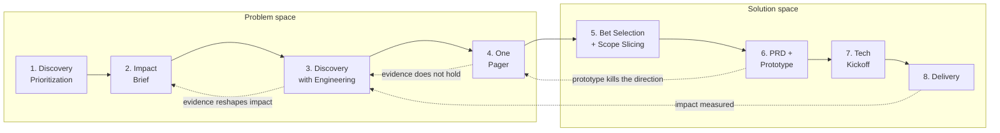
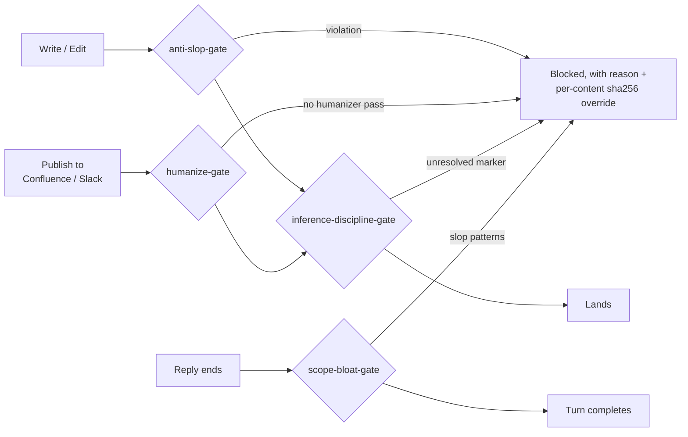

# ai-pm-toolkit

**An operating system for product managers, built for Claude Code and Codex alike. Skills ask nicely; hooks enforce.**

[](LICENSE)
[](scripts/check_requirements.sh)
[](https://docs.anthropic.com/en/docs/claude-code)
[](https://developers.openai.com/codex/cli)
[](skills/)
[](hooks/)
[](https://github.com/lukesw55/ai-pm-toolkit/pulls)

This toolkit turns a vague idea into a shipped increment through an 8-stage pipeline, 21 hard-skill PM skills, layered cross-project memory, and four runtime hooks that **block** selected structural patterns, unresolved inference markers, and unmarked outbound prose on configured routes. The repository provides eval cases and a grader for recorded with-skill and no-skill runs. No live benchmark results are published yet.

It is the company-agnostic core of a working PM toolkit: the skills, agents, hooks, and doctrine one PM uses daily, with the employer-specific stack and customer evidence stripped out.

- [Why it exists](#why-it-exists)
- [At a glance](#at-a-glance)
- [The pipeline](#the-pipeline)
- [The skills](#the-skills)
- [Enforcement, not vibes](#enforcement-not-vibes)
- [The toolkit grades itself](#the-toolkit-grades-itself)
- [Memory that survives context switching](#memory-that-survives-context-switching)
- [The agents](#the-agents)
- [Install](#install)
- [Scripts](#scripts)
- [Validation](#validation)
- [Repository layout](#repository-layout)
- [Requirements](#requirements)
- [Troubleshooting](#troubleshooting)
- [License](#license)

## Why it exists

LLM coding agents default to plausible-but-bloated output: speculative abstractions, defensive checks at internal boundaries, confident claims about things they never verified, and prose that reads like a press release. For a PM driving an agent, that failure mode is expensive, because you are accountable for what ships and for what you tell stakeholders.

This toolkit encodes the corrections as reusable skills and as hooks the harness runs automatically. The model does not get to opt out.

## At a glance

| Capability | What it does | Where |
|---|---|---|
| 8-stage pipeline | Discovery Prioritization through Delivery, one gate per stage, current stage auto-injected into every turn | [`skills/WORKFLOW.md`](skills/WORKFLOW.md) |
| 21 hard-skill PM skills | 4 Double Diamond phases, 4 archetype lenses, 8 transversals, 4 quality gates, a repo doctor | [`skills/`](skills/) |
| 4 blocking runtime hooks | Reject slop prose, unverified claims, scope bloat, and unhumanized publishes at tool-call time | [`hooks/`](hooks/) |
| Claude Code + Codex, both first-class | Same skills, same gates, same doctrine in both harnesses — `.claude/` and `.codex/` are thin adapters over one canonical tree | [`skills/`](skills/), [`hooks/`](hooks/), [`.codex/`](.codex/) |
| Skill benchmarking | Grades skill output against a no-skill baseline, emits an HTML report | [`scripts/grade_evals.py`](scripts/grade_evals.py) |
| Layered memory | Hot / warm / cold context that survives project switching; PII is never rotated | [`scripts/memory.py`](scripts/memory.py) |
| Orchestrator + 10 agents | "Umberto" detects the working mode and sequences stages; 6 core agents plus 4 PM archetypes | [`SKILL.md`](SKILL.md), [`.github/agents/`](.github/agents/) |
| Self-validation | Frontmatter, link, hook-wiring, and memory-contract checks in one command | [`scripts/validate_repo.py`](scripts/validate_repo.py) |

## The pipeline



The solid line is the default path. During Discovery, evidence updates the Impact Brief instead of leaving its commercial case frozen. Engineering joins that work when feasibility is material, before the One Pager hardens a direction. The other dotted edges return unsupported bets to the opportunity tree, failed prototype directions to the One Pager, and measured delivery impact to the next opportunity.

Each stage has a skill that produces its artefact and a gate that must pass before advancing:

| # | Stage | Skill | Artefact | Gate |
|---|---|---|---|---|
| 1 | Discovery Prioritization | `pm-phase-define` + régua comum | `discovery-priorities.md` | top-N problems chosen, with rationale |
| 2 | Impact Brief | `pm-phase-discover` | `impact-brief-<topic>.md` | GTM impact + invalidation conditions named |
| 3 | Discovery | `pm-phase-discover` | discovery synthesis + opportunity tree | problem and JTBD validated, Impact Brief updated, material feasibility reviewed with a technical partner, unverified assumptions tested or explicitly accepted |
| 4 | One Pager | `pm-phase-define` | `one-pager-<topic>.md` | approved by stakeholders, after the mandatory `pm-product-sense` shadow evaluation |
| 5 | Bet Selection + Scope Slicing | `pm-phase-define` + `pm-phase-develop` | `priorities.md` + `scope-slices.md` | validated bet selected; V1, later slices, learning goal and non-goals agreed |
| 6 | PRD + Prototype | `pm-phase-develop` | `prds/<feature>.md` + prototype | PRD approved, prototype validated at the chosen tier, after the mandatory `pm-product-sense` shadow evaluation |
| 7 | Tech Kickoff | `pm-phase-develop` | kickoff deck + epic | team aligned, dependencies and NFRs clear |
| 8 | Delivery | `pm-phase-deliver` | launch kit + close-out | GA shipped, impact measured |

The current stage lives in `.ai/memory/active-context.md` and is injected into every turn (Claude Code and Codex alike) by a `UserPromptSubmit` hook, so the model always knows where in the pipeline it is working. Stages advance with `python3 scripts/advance_stage.py <slug>`; the progression is a default, not a cage, and the bypass rules are documented in [`WORKFLOW.md`](skills/WORKFLOW.md).

The orchestrator is a skill codenamed **Umberto** ([`SKILL.md`](SKILL.md)). It detects the working mode first — Kickoff, Feature, Bug, or Rescue — then sequences the phases and loads the right skill at each stage.

## The skills

| Family | Skills | What they cover |
|---|---|---|
| Phases (4) | `pm-phase-discover`, `pm-phase-define`, `pm-phase-develop`, `pm-phase-deliver` | problem framing, research and the opportunity solution tree; strategy, KPI trees, prioritisation, business cases; PRDs, scope slicing, instrumentation; launch readiness, release comms, experiment interpretation |
| Archetype lenses (4) | `pm-archetype-ai`, `pm-archetype-enterprise`, `pm-archetype-growth`, `pm-archetype-platform` | evals and guardrails for probabilistic products; SSO/RBAC/compliance/procurement; funnels and experimentation discipline; APIs, DX, deprecation, SLOs |
| Transversals (8) | `pm-transversal-stakeholder`, `pm-transversal-docs`, `pm-transversal-analysis`, `pm-transversal-comms`, `pm-prioritization-regua-comum`, `pm-storytelling`, `pm-product-sense`, `data-science-analyst` | DACI, exec reporting and a risk-selected review panel; Confluence/Jira hygiene; quali+quant triangulation, batch interview synthesis and connector recipes; exec email (SCQA) and chat (BLUF); Impact × Effort with one shared ruler; narrative spines; product-sense BUILD/EVALUATE (shadow-gates stages 4 and 6); technical correctness of the analysis itself |
| Quality gates (4) | `anti-slop`, `humanizer`, `humanize-deliverables`, `inference-discipline` | slop removal for code and structure; prose that reads like a person wrote it; a publish gate for outbound artefacts; the hallucination gate |
| Tooling (1) | `repo-doctor` | read-only health check of this workspace |

The archetype lenses are compositional skills: one `SKILL.md` that composes the phase and transversal references and carries its own `evals/evals.json`. A lens gains a `references/` folder only when a real need appears; today that is `pm-archetype-ai`, whose eval-design reference is the PM-owned method for product evals. Each lens also ships as an agent in [`.github/agents/`](.github/agents/) for harnesses that speak that dialect. They stack on top of any phase skill when the product context is non-default.

Every skill ships a `SKILL.md` as its control plane. Most add a `references/` folder with ready-to-paste templates plus a `progressive-loading.md` map, so the model loads the narrowest reference the task needs instead of a whole catalogue.

Every skill also carries an `evals/evals.json` with at least three cases, one of them adversarial. `scripts/validate_repo.py` enforces that floor and the one-to-one parity with the grader, so a skill can be graded rather than trusted.

Skills support three output profiles (see [`docs/patterns/COMMUNICATION_MODES.md`](docs/patterns/COMMUNICATION_MODES.md)): Standard for stakeholder-grade analysis, Lean for routine work (the default), Caveman for token-constrained sessions.

## Enforcement, not vibes

Four hooks in [`hooks/`](hooks/), wired through [`.claude/settings.json`](.claude/settings.json) for Claude Code and [`.codex/hooks.json`](.codex/hooks.json) for Codex, reject bad output at tool-call time in both harnesses:

| Hook | Fires on | Blocks |
|---|---|---|
| `anti-slop-gate.sh` | every file write/edit | forbidden file artefacts (unrequested PLAN/SUMMARY/NOTES files), banner comments, decorative emoji headings |
| `inference-discipline-gate.sh` | writes and outbound publishes | five literal unresolved inference markers; semantic fact-checking remains the skill’s responsibility |
| `humanize-gate.sh` | Confluence / Slack / Jira publish tools | AI-tinted prose shipping outbound before a `humanizer` pass, tracked by a per-content sha256 sentinel |
| `scope-bloat-gate.sh` | end of every reply (Stop) | em-dash density, label-colon bullet runs, headers on short questions, scope bloat |



Each gate has an explicit, per-content override for legitimate exceptions, so the enforcement is strict without being a dead end. Three softer hooks complete the wiring: `memory-context.sh` injects the memory hot layer at session start and stamps the session start, `check-project-isolation.sh` (Claude Code only) warns when a tool touches another project's memory, and `memory-reminder.sh` reminds, at Stop, when files or commits changed after the last changelog entry `memory.py log` wrote. None of the three blocks.

## The toolkit grades itself

Every skill ships an `evals/evals.json` with realistic task prompts across four categories (standard, doctrine-adversarial, skill-functional-adversarial, negative-control); the validator requires at least three cases and one adversarial case per skill, a negative control on the five doctrine skills, and one-to-one parity with the grader's assertion blocks. [`scripts/grade_evals.py`](scripts/grade_evals.py) grades recorded runs **with the skill against a no-skill baseline** — assertion by assertion — and renders a static HTML benchmark report with pass rates, timing, and token cost per configuration, plus the disagreement rate between the assertions and the human verdicts when labels exist.

As of 2026-09-10 the manifests hold 85 cases across the 21 skills: 43 standard, 11 doctrine-adversarial, 15 skill-functional-adversarial and 16 negative controls. The validator enforces the floor, not the total.

Recording instructions, the pilot runner and the labelling step are in [`docs/EVAL_PROTOCOL.md`](docs/EVAL_PROTOCOL.md). The two-harness pilot runs through `scripts/run_eval_pilot.py` on a machine where both CLIs are authenticated, human verdicts are tracked under `docs/benchmarks/`, and no measured result is published until the first iteration lands there. Synthetic fixtures test the grader, not skill effectiveness.

The point is falsifiability: a skill that does not beat the baseline on its own evals is a skill to fix or delete, not to keep out of sentiment.

## Memory that survives context switching

| Layer | Contents | When it is read |
|---|---|---|
| Hot | a capped pointer (`active-context.md`) plus `index.md` | injected at session start |
| Warm | the project's state, kickoff, decisions, recent changelog | only when working on that project |
| Shared org | `org/`: company, personas as archetypes, competitors, cycle goals | when the task needs company context; one file at a time, never injected by hooks |
| Cold | archives, raw evidence, transcripts | never wholesale; grep-first via the archive index, then one block |

Writing memory goes through [`scripts/memory.py`](scripts/memory.py) (`log`, `park`, `activate`, `distill`, `index`, `doctor`). It rotates old changelog entries into archives, keeps an index block at the top of each archive so the cold layer stays searchable, and holds the pointer under its 2 KB cap.

PII and raw-evidence paths are never rotated, distilled, or ingested: `memory.py` refuses them in code (`PII_DENY`). The shipped tree contains only templates, so a fresh clone bootstraps its own memory with one command. The shared org layer is bootstrapped with `python3 scripts/init_context.py --org`; upstream keeps it ignored and a fork versions its real content.

## The agents

[`.github/agents/`](.github/agents/) holds ten agents. Six are core: **pm-kickoff** (kickstart and reframing), **pm-orchestrator** (the main builder), **pm-tech-advisor** (architecture and tradeoffs), **pm-evidence** (failure analysis and metric quality), **pm-design** (design planning and review), **pm-memory** (memory steward). Four mirror the archetype skills — `pm-platform`, `pm-growth`, `pm-enterprise`, `pm-ai` — for non-default product contexts. Default orchestration chains live in [`AGENTS.md`](AGENTS.md).

## Install

Clone the repo and open it as a project. Claude Code reads `.claude/settings.json`
and `.claude/skills/`; Codex reads `.codex/hooks.json` and `.agents/skills/`.
The two skill directories are generated mirrors of `skills/`. The `hooks/` tree is
canonical and used directly by both adapters. In Codex, run `/hooks` to trust the
hook hashes before enforcement starts, and repeat after hook or adapter changes.
The project-isolation warning is currently Claude Code only.

```bash
git clone https://github.com/lukesw55/ai-pm-toolkit.git
cd ai-pm-toolkit
bash scripts/check_requirements.sh   # preflight: bash, Python >=3.10, jq, git, sha256
python3 scripts/validate_repo.py     # structural self-check (both harnesses)

# bootstrap your first project context
python3 scripts/init_context.py "my-product"
python3 scripts/memory.py doctor
```

On Codex, run `/hooks` once to trust the shared enforcement scripts (re-run it after any edit to `hooks/*.sh` — Codex tracks trust by content hash).

Then, in either harness, invoke any skill by name (for example `pm-phase-discover`) or talk to the orchestrator:

```text
We are starting my-product. Read the context files.
Run Discover and Define. Ask only the highest-leverage missing questions.
Create an experiment plan for the smallest viable proof. Update memory when done.
```

## Scripts

| Script | Purpose |
|---|---|
| `init_context.py` | bootstrap a project: memory files, warm layer, and the active pointer (refuses to clobber an active project); `--org` creates the shared org layer |
| `memory.py` | memory policy engine: `log`, `park`, `activate`, `distill`, `index`, `doctor` |
| `stage_context.py` | inject the current workflow stage into every turn (`UserPromptSubmit` hook) |
| `advance_stage.py` | move the pipeline to the next stage |
| `context_watch.py` | live CLI view of the active context and time spent per context |
| `log_decision.py` | append a decision to the active project's decision log |
| `validate_context.py` | schema check for `active-context.md` |
| `context_paths.py` | shared slug validation and project path boundary used by every context writer |
| `grade_evals.py` | grade eval runs with-skill vs baseline; join human labels and report the disagreement rate; emit benchmark JSON + HTML report |
| `record_eval_run.py` | record one externally produced eval output with provenance (model, source, commit, hashes); never generates output |
| `run_eval_pilot.py` | drive a harness CLI through the pilot: payloads from the dependency manifest, fresh directory per run, seeded order, isolation probe, attempts log, provenance sidecar bound to the run's validation, verified-version gate |
| `label_eval_run.py` | append a human verdict and classification to a recorded run, keyed by run identity and output hash; corrections supersede, history stays |
| `validate_repo.py` | structural validator: frontmatter, links, workflow contract, hook wiring (both harnesses), hook neutrality, mirror drift, eval coverage and grader parity, memory bootstrap, Copilot agent schema and repo policy |
| `test_hooks.py` | synthetic payloads through the shared gates, the Codex `apply_patch` adapter, and the soft session-close reminder |
| `test_grade_evals.py` | fixtures for the grader's assertion blocks: good output has to score high, bad output low; strict pairs add a keyword-only reply that must score low and a near miss that fails exactly one named assertion |
| `test_record_eval_run.py` | the eval recorder refuses missing provenance, changed output and overwrites; renders the HTML report from a recorded pair |
| `test_run_eval_pilot.py` | the pilot runner against a fake harness: recorded runs, provenance, seeded order, probe, attempts, version gate, refusals (code paths, not CLI compatibility) |
| `test_label_eval_run.py` | the label file, run identity and hash binding, supersede and split rules, the grader's two disagreement rates and the investigate flag |
| `test_context_scripts.py` | slug traversal, symlink escapes, idempotent bootstrap, the org layer, project switching, legacy migration and the preflight version check |
| `test_hook_contract.py` | malformed Codex envelopes block with exit 2; adapter routes match `hooks/contract.json`; the configured write commands really block a marker |
| `test_frontmatter.py` | the portable frontmatter grammar gives the same values and verdicts with and without PyYAML |
| `test_memory.py` | `memory.py` in a throwaway repo: caps, the distill fold, the archive index, the in-code PII denylist |
| `test_validate_repo.py` | feeds the validator valid JSON and agent frontmatter in unexpected shapes and asserts a finding comes back, not a traceback |
| `sync_skills.py` | regenerate `.claude/skills/` and `.agents/skills/` from the canonical `skills/` tree; `--check` for a read-only drift check |
| `check_requirements.sh` | environment preflight (bash, Python >=3.10, jq, git, sha256) |

## Validation

Run the repo doctor before shipping changes to the toolkit itself:

```bash
bash scripts/check_requirements.sh
python3 -m py_compile scripts/*.py
for hook in hooks/*.sh; do bash -n "$hook" || exit; done
python3 scripts/sync_skills.py --check
python3 scripts/validate_repo.py
python3 -S scripts/validate_repo.py
python3 scripts/test_hooks.py
python3 scripts/test_hook_contract.py
python3 scripts/test_grade_evals.py
python3 scripts/test_memory.py
python3 scripts/test_context_scripts.py
python3 scripts/test_record_eval_run.py
python3 scripts/test_run_eval_pilot.py
python3 scripts/test_label_eval_run.py
python3 scripts/test_validate_repo.py
python3 scripts/test_frontmatter.py
python3 scripts/grade_evals.py
python3 scripts/memory.py doctor
```

`validate_repo.py` checks skill frontmatter, local markdown links and backtick-quoted file paths, workflow-stage parsing, hook settings for both harnesses, hook syntax and harness-neutrality, mirror drift, eval coverage and its parity with the grader, the memory bootstrap contract, and `.github/agents/` — the published schema plus a narrower repo policy the messages name as policy (tool aliases in canonical lowercase, no `model`, delegation targets that resolve, one shared required-reading section). The `test_*.py` suites cover the runtime behaviour the validator cannot see: what the gates block and how each adapter routes them, what the grader scores, what `memory.py` and the context scripts do to a real tree, how a recorded eval run is validated, what the pilot runner and the label step record, and how the validator behaves on malformed input. It is zero-dependency except for optional PyYAML. Without PyYAML it parses the canonical frontmatter subset this repo uses — scalars, inline lists, booleans and block scalars — and tolerates nested mappings outside the validated fields without interpreting them; it is not a YAML parser, so a validated field in any other form becomes a finding rather than passing unread. CI runs the validator both ways. The full checklist lives in [`docs/REPO_HEALTH.md`](docs/REPO_HEALTH.md).

## Repository layout

Shared product logic — skills, enforcement, doctrine — lives once, at the top level. Claude Code and Codex are peers, each a thin adapter over that one canonical tree; neither is the "real" copy the other degrades from.

```text
.
├── SKILL.md                 # orchestration entrypoint (Umberto)
├── CLAUDE.md                # working doctrine and guardrails (Claude Code adapter)
├── AGENTS.md                # working doctrine and guardrails (Codex adapter) + agent registry
├── skills/                  # CANONICAL — the only place skills are hand-edited
│   ├── WORKFLOW.md          # 8-stage pipeline mapped to skills and gates
│   ├── DOCTRINE.md          # calibrated disagreement — not a skill, referenced by several
│   ├── pm-phase-*/          # the four phases
│   ├── pm-archetype-*/      # ai / enterprise / growth / platform lenses
│   ├── pm-transversal-*/, pm-prioritization-*/, pm-storytelling/, pm-product-sense/
│   ├── anti-slop/, humanizer/, humanize-deliverables/, inference-discipline/
│   ├── data-science-analyst/
│   └── repo-doctor/         # most skills: references/ + evals/ + progressive-loading.md
├── hooks/                   # CANONICAL — 4 blocking gates, 3 mark helpers, 3 context hooks
├── .claude/
│   ├── settings.json        # Claude Code adapter: hook wiring
│   └── skills/               # generated mirror of skills/ — never hand-edited
├── .agents/
│   └── skills/               # generated mirror of skills/ (Codex discovery) — never hand-edited
├── .codex/
│   ├── hooks.json           # Codex adapter: hook wiring
│   └── adapters/             # apply_patch normalization (the one Codex-only script)
├── docs/                    # process, memory model, guardrails, comms modes, repo health, benchmarks (pilot deps, labels, reports)
├── scripts/                 # memory, workflow, eval, sync, and validation tooling
├── .ai/                     # project-brief templates, memory skeleton, gate sentinel state
└── .github/agents/          # 6 core agents + 4 PM archetypes (read skills/ directly)
```

## Requirements

- Claude Code with project-level `.claude/settings.json` enabled, or Codex with `.codex/hooks.json` trusted (`/hooks`) — either harness alone is enough; both work together.
- Python 3.10+ for memory, workflow, eval, sync, and repo validation scripts.
- Bash for hooks.
- `jq` for hook JSON parsing.
- Either `sha256sum` (Linux) or `shasum -a 256` (macOS) for per-content sentinels.

## Troubleshooting

- **`memory.py doctor` says there is no ACTIVE block:** run `python3 scripts/init_context.py "Project Name"` or activate a project with `python3 scripts/memory.py activate <slug>`.
- **`init_context.py` refuses to run:** another project is still active; park it first with `python3 scripts/memory.py park <slug>`.
- **Hooks fail with `jq: command not found`:** install `jq`, then rerun `bash scripts/check_requirements.sh`.
- **macOS hash command fails:** hooks fall back from `sha256sum` to `shasum -a 256`; if both are missing, install the standard command-line tools.
- **A publish tool is blocked by `humanize-gate`:** run the `humanizer` pass, then mark the exact final bytes with `hooks/humanize-mark.sh`.
- **A file edit is blocked by inference discipline:** resolve the unresolved inference markers (INFER, ASSUMING, UNVERIFIED, FROM MEMORY, RECALL), or explicitly approve and mark the exact exception.
- **Workflow stage output is too thin:** check `.ai/memory/active-context.md` has `Current stage` set to one of the canonical slugs in `skills/WORKFLOW.md`.
- **A mirror looks stale or edits to a skill aren't showing up in Codex (or vice versa):** run `python3 scripts/sync_skills.py` — edits go in `skills/` only; `.claude/skills/` and `.agents/skills/` are generated and never hand-edited.
- **Hooks aren't firing in Codex after a change to `hooks/*.sh`:** Codex requires trusting hooks by content hash; re-run `/hooks` in the Codex CLI after any edit to a shared script.

## License

MIT. See [LICENSE](LICENSE). Issues and PRs welcome.

### Third-party

`skills/humanizer/` is a re-sync of [blader/humanizer](https://github.com/blader/humanizer) by Siqi Chen (MIT), pinned to upstream commit `e2e92e7b4b8229253ed5c8e81dc65463fdeddda5` (version 2.11.2). Its license is kept verbatim at [`skills/humanizer/LICENSE`](skills/humanizer/LICENSE) and copied into both generated mirrors; [`skills/humanizer/README.md`](skills/humanizer/README.md) records what is upstream content, what is structural reorganisation, and what is this repo's overlay.

## Project context and toolkit history

Resolve the active slug from `.ai/memory/active-context.md`. Read the active project's
`app.md`, `design.md` and `tasks.md` under `.ai/memory/projects/<slug>/`, alongside its
warm memory. Unfilled template fields are unknown, not verified facts. New projects
receive these files from the tracked templates. Re-running `init_context.py` fills
missing files without resetting stage, state or parked projects.

For an existing workspace, explicitly run `python3 scripts/init_context.py --migrate-legacy <project-name>`
to copy legacy repo-level app/design/tasks into missing project files. It keeps the
sources and never replaces a destination. Review existing destinations manually
when both versions contain work. Park the current project before initializing another.

Toolkit changes belong in the versioned changelog through `python3 scripts/memory.py log repo "<change and validation>"`.
Project activity belongs in the project's changelog. Binding toolkit decisions live
in `docs/DECISIONS.md`; historical PR integrations are recorded in `docs/PR_HISTORY.md`.
PRs should record validation on the reviewed head. A self-review is not independent
approval; if GitHub rejects self-approval, disclose that and retain the checks as evidence.

The CI tests Python 3.10 and 3.11; the stable `validate` job requires both matrix jobs to pass. Push runs target `main`; pull requests run once per event, with superseded runs cancelled. The preflight rejects Python below 3.10. Progressive-loading maps must name every support file in their skill. Context tests cover traversal, symlinks, switching, non-destructive migration and read-only status/report commands.
